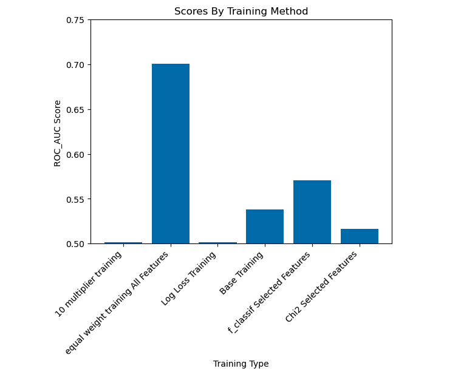

# Arvato ML Captstone
This project is my captstone project for the Udacity AWS ML Engineer course.

## Project Setup & Execution
1. You will need to setup sagemaker studio profile within your AWS account
2. Upload the Arvato training data set csv to your sagemaker default buckets /data directory (naming it train.csv)
3. Create a sagemaker notebook and set this repo as the repo to pull from.
4. Within Sagemaker studio open the clean_train.flow file
   1. First click Run Validation
   2. Then click create job and setup csv export job
   

5. In the "Clean Data Train" section (in project_workbook.ipynd) you'll need to replace the train_data = pd.read_csv(f'{s3_data_path}/clean-large.csv') file path with the path of where your data processing job dumps the CSV.
6. Should be able to run all the cells in project_workbook.ipynd and recreate results.


# Arvato Customer Classification Project Report
In this project the primary objective was to take in a training data set with many features, refine the data and train a model to make predictions on whether a prospective customer will become a customer of Arvato based on customers who had bought in the past and their demographic data.


## Project Objective
As mentioned above the goal of this project was to come up with a model that could predict if a perspective customer will convert into becoming a paying customer. To make this determination a raw dataset was provided that had several hundred demographic features (who's meaning are described in the DIAS Attribute file) and a label column (the RESPONSE column).

## Project Data
### train.csv
The train file contains instances where the company actually mailed out advertorials. Many of the same demographic columns as the other files but includes a "RESPONSE" column that indicates which of these customers actually purchased.
### Dias Attributes - Values 2017.xlsx & DIAS Information Levels - Attributes 2017.xlsx
These files give descriptions of each of the features I used to train the models.

## Evaluation Metric
This project originally came from this [Kaggle Compilation](https://www.kaggle.com/competitions/udacity-arvato-identify-customers/overview) and the metric for success for this compilation is [AUC ROC score](https://towardsdatascience.com/understanding-auc-roc-curve-68b2303cc9c5). AUC ROC score is a better evaluation metric than accuracy alone because as I learned in this project with a heavily unbalanced dataset you can have a near 100% accuracy score (because one of the labels is represented far less than the others) but still have a poorly performing model.
AUC ROC has a score from 0 to 1 with 0 being a poorly performing model, 1 being a perfectly performing model and a 0.5 indicating the model is not able to distinguish between the labels in the dataset. I was originally planning on making submissions to the Kaggle competition but the compilation was closed so instead I will split the train data into a training dataset and an evaluation dataset and evaluate the model on the evaluation dataset (and generate aan auc_roc score from this).

## Model Creation
In order to generate a model that can make predictions on this training dataset I used the AutoGluon ML Toolkit, specifically the [TabularPredictor](https://auto.gluon.ai/stable/api/autogluon.tabular.TabularPredictor.html). As I explain later in this report I went through several trail trainings with the TabularPredictor and determined which parameters and techniques produced the best auc_roc score.

## Data Exploration
There are many features in this data set, one of the ones I thought might be representative is LP_LEBENSPHASE_FEIN (lifestage fine), LP_LEBENSPHASE_GROB (lifestage rough), LP_STATUS_FEIN (lifestyle fine) & ANREDE_KZ (sex). Below are several histograms between the observed customer base and the general population.


When looking at these charts for the first three lower numbers generally mean less affluent and higher numbers mean more affluent and for the last chart 1 represents men and 2 represents women.
So comparing the two distributions we can see our customers are more affluent and more regularly men compared to the rest of the population.

Another key aspect to this data was the unbalanced nature of it. In the training set we have two labels 0 (customer did not purchase) and 1 (customer did purchase).


## Benchmark Model
In order to create a benchmark to compare my other models to I did a training on just a subset of the data (the subset of lifestyle, social status and sex of the perspective customers). When initially doing a training run on this subset I was not able to obtain a auc_roc score because the trained model did not predict any PURCHASE labels. This is when I realized because of the unbalanced nature of the labels I would need to configure TabularPredictor with its sample_weight and weight_evaluation parameters. The sample_weight parameter essentially is a column in your training set that is a positive value. In order to have these waits taken into account during evaluation the weights must be normalized and the weight_evaluation parameter must be set to True.

My basic strategy was to bring the PURCHASE labels in balance with the NOPURCHASE labels, I determined that multiplier with the code below

```python
#Get Buyers
purchase_records = train_data[train_data['RESPONSE'] == 'PURCHASE']
#Get NonBuyer Records
no_purchase_records = train_data[train_data['RESPONSE'] == 'NOPURCHASE']

buyer_weight_multiplier = math.floor(len(no_purchase_records) / len(purchase_records))
```
I then set the PURCHASE records RECORD_WEIGHT column to that multiplier and all of the NOPURCHASE records RECORD_WEIGHT column values to 1. Then I normalized RECORD_WEIGHT with the code below:
```
train_data['RECORD_WEIGHT'] /= train_data['RECORD_WEIGHT'].sum()
```

With this done I was ready to do bench mark training with this code:
```
predictor = TabularPredictor(label="RESPONSE", sample_weight='RECORD_WEIGHT', weight_evaluation=True).fit(
    train_data=init_train_data,
    time_limit=600,
    presets="best_quality"
)
```
The initial benchmark AUC ROC was 0.53815 which is well above 0 but does signify that the model has a lot of trouble distinguishing between the two labels.

## Data Processing
In order to refine the dataset provided I made the decision to make use of Sagemaker Data Wranger. This process consisted of uploading the data into Data Wrangler via a CSV import from an S3 bucket then making several transforms to the data so as to make it easier to feed into TabularPredictor.


1. Import Data Into Data Wrangler
2. Change Data Types
    1. For this I noticed most of the features where categorical ints so I transformed them into the Long data type, there were also some date and string features that needed to be adjusted.
3. In some initial processing runs it was necessary to sample the data because even with Data Wrangler if the samples were too large there was a significant lag, so in the intial jobs I set the sample to 500 records, then once I had the flow setup in a way I thought satisfactory I upped the sample to a number more closely representing the whole dataset.
4. In the next step I encoded the features that were dates.
5. I then dropped columns that did not appear in the DIAS Attributes sheet as I didn't think they could be useful since I had no context as to what they were.
6. Next I filled in na feature values with the median value of the other records of that feature.
7. Lastly I one hot encoded all the remaining string features as they would not otherwise be useful during the training process.
8. This all concluded with an export to an s3 csv file.
   

** One note if you check the notebook I did do some extra encoding and dropping of na columns after the processing because data wrangler was having some issues and was becoming too expensive for this projects budget.

## Initial Hypothesis
My initial hypothesis going into this project was that I would use the log_loss evaluation metric for training as it was surmised that this would account for an Unbalanced data set. I also thought that using [sklearn.feature_selection.SelectPercentile ](https://scikit-learn.org/stable/modules/generated/sklearn.feature_selection.SelectPercentile.html#sklearn.feature_selection.SelectPercentile) would be useful in pruning features that were not relevant to the classification problem.

## Model Tweaking and Evaluation
### Feature Selection Trainings
I selected the top 90 percentile of features using the f_classif and chi2 score functions. I was able to determine which features would be used for training using this basic method:
```
X, y = train_data[features], train_data['RESPONSE']

scaler = MinMaxScaler()
X_scaled = scaler.fit_transform(X)
X_abs = X.abs()
selector = SelectPercentile(chi2, percentile=90)

selected_features = selector.fit_transform(X_abs, y)
selected_feature_indices = selector.get_support(indices=True)
selected_feature_names = np.array(features)[selected_feature_indices]
```
** Note this was for the chi2 score function that only accepts positive values, the method for the f_classif score function was much simpler and essentially didn't require any transformations (values could be negative).

I went through training runs with only the features selected from each of these selection processes (including the weights from the base training) and obtained auc_roc scores from each.

### Lower Weight Training
I also went through a process of lowering the PURCHASE record weights, went through a training run with the full feature selection and obtained an auc_roc score from this method.

### Log Loss Training
Lastly I dropped the RECORD_WEIGHT column and performed a log_loss training with the code below:
```
predictor_ll = TabularPredictor(label="RESPONSE", eval_metric="log_loss").fit(
    train_data=final_train_data_ll,
    time_limit=600,
    presets="best_quality"
)
```
and obtained an auc_roc score from this method.

### Results

Based on the evaluations conducted it appeared that my hypothesis were incorrect (at least for how the data was formatted). The more features with an equal label weighting resulted a higher probablity that the model would be able to distinguish between a customer who would purchase and one who would not.

## Model Deployment
Lastly I just wanted to demonstrate that I could deploy an TabularPredictor model to an inference endpoint as this was not something done in the class materials and did not seem trivial.


## Next Iterations
I think there is some room for improvement, specifically in the data processing steps. If given another opportunity I may run through the data wrangler step again and not prune as many columns as was done initially, I surmise that I may have ended up pruning data that had a more key relationship to the target than I had initially thought. I might also take another look at the data type transforms that were done.

## Justification
In the end a model with an auc_roc score 0.63 (at one point having a score as high as 0.67) does offer some insight into which customers would become paying customers and those who would not (well above 0.5 and closer to 1 than 0). As an initial MVP I feel this result is an adequate solution to the problem.

## Citations
### AUC ROC Score Explanation
[https://towardsdatascience.com/understanding-auc-roc-curve-68b2303cc9c5](https://towardsdatascience.com/understanding-auc-roc-curve-68b2303cc9c5)

### Kaggle Competition
[https://www.kaggle.com/competitions/udacity-arvato-identify-customers/overview](https://www.kaggle.com/competitions/udacity-arvato-identify-customers/overview)
### Model Deployment
[https://docs.aws.amazon.com/sagemaker/latest/dg/autogluon-tabular.html](https://docs.aws.amazon.com/sagemaker/latest/dg/autogluon-tabular.html)

[https://github.com/aws/amazon-sagemaker-examples/blob/main/introduction_to_amazon_algorithms/autogluon_tabular/Amazon_Tabular_Classification_AutoGluon.ipynb](https://github.com/aws/amazon-sagemaker-examples/blob/main/introduction_to_amazon_algorithms/autogluon_tabular/Amazon_Tabular_Classification_AutoGluon.ipynb)


