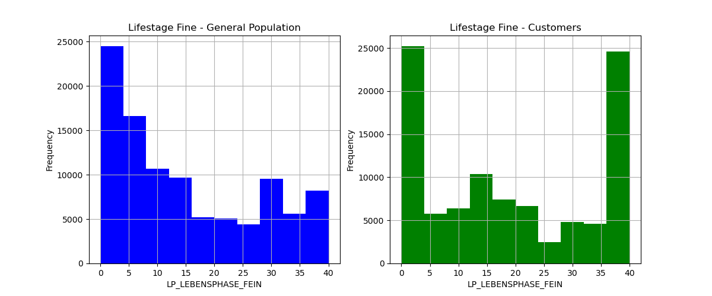
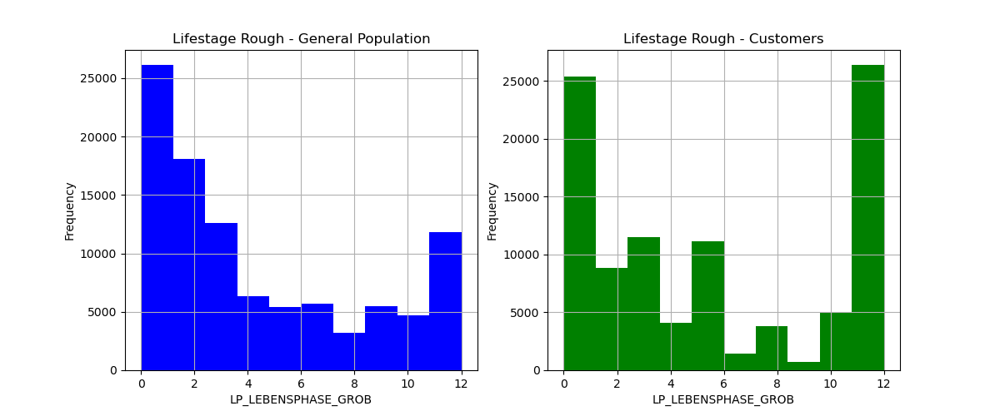
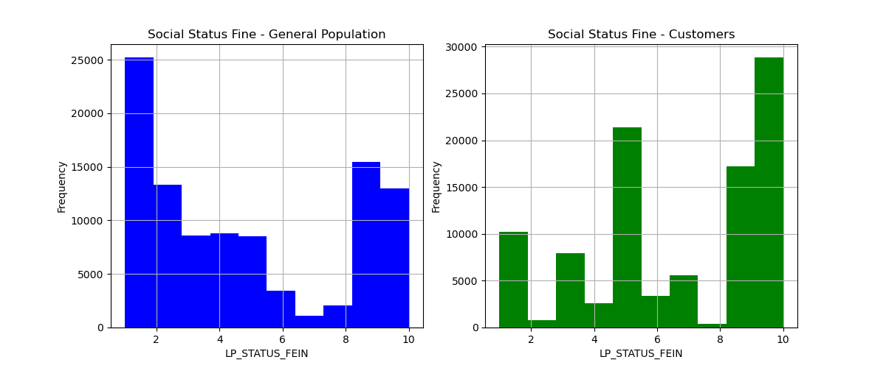
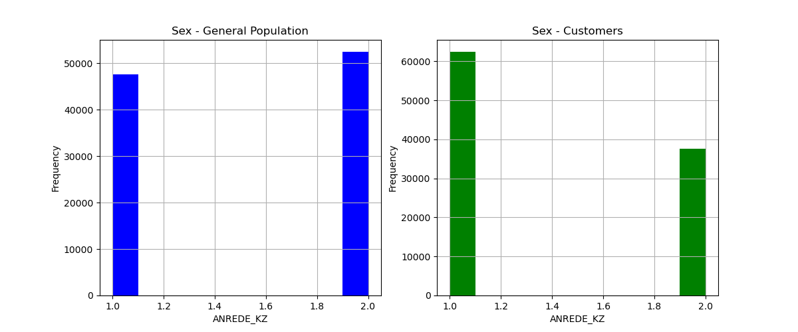

# Arvato Customer Classification Project
In this project the primary objective was to take in a training data set with many features, refine the data and train a model to make predictions on whether a prospective customer will become a customer of Arvato based on customers who had bought in the past and their demographic data.

## Project Objective
As mentioned above the goal of this project was to come up with a model that could predict if a perspective customer will convert into becoming a paying customer. To make this determination a raw dataset was provided that had several hundred demographic features (who's meaning are described in the DIAS Attribute file) and a label column (the RESPONSE column).

## Evaluation Metric
This project originally came from this [Kaggle Compilation](https://www.kaggle.com/competitions/udacity-arvato-identify-customers/overview) and the metric for success for this compilation is [AUC ROC score](https://towardsdatascience.com/understanding-auc-roc-curve-68b2303cc9c5). AUC ROC score is a better evaluation metric than accuracy alone because as I learned in this project with a heavily unbalanced dataset you can have a near 100% accuracy score (because one of the labels is represented far less than the others) but still have a poorly performing model.
AUC ROC has a score from 0 to 1 with 0 being a poorly performing model, 1 being a perfectly performing model and a 0.5 indicating the model is not able to distinguish between the labels in the dataset. I was originally planning on making submissions to the Kaggle competition but the compilation was closed so instead I will split the train data into a training dataset and an evaluation dataset and evaluate the model on the evaluation dataset (and generate aan auc_roc score from this).

## Model Creation
In order to generate a model that can make predictions on this training dataset I used the AutoGluon ML Toolkit, specifically the [TabularPredictor](https://auto.gluon.ai/stable/api/autogluon.tabular.TabularPredictor.html). As I explain later in this report I went through several trail trainings with the TabularPredictor and determined which parameters and techniques produced the best auc_roc score.

## Data Exploration
There are many features in this data set, one of the ones I thought might be representative is LP_LEBENSPHASE_FEIN (lifestage fine), LP_LEBENSPHASE_GROB (lifestage rough), LP_STATUS_FEIN (lifestyle fine) & ANREDE_KZ (sex). Below are several histograms between the observed customer base and the general population.

When looking at these charts for the first three lower numbers generally mean less affluent and higher numbers mean more affluent and for the last chart 1 represents men and 2 represents women.
So comparing the two distributions we can see our customers are more affluent and more regularly men compared to the rest of the population.

